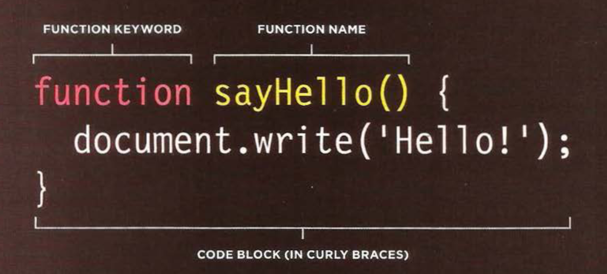
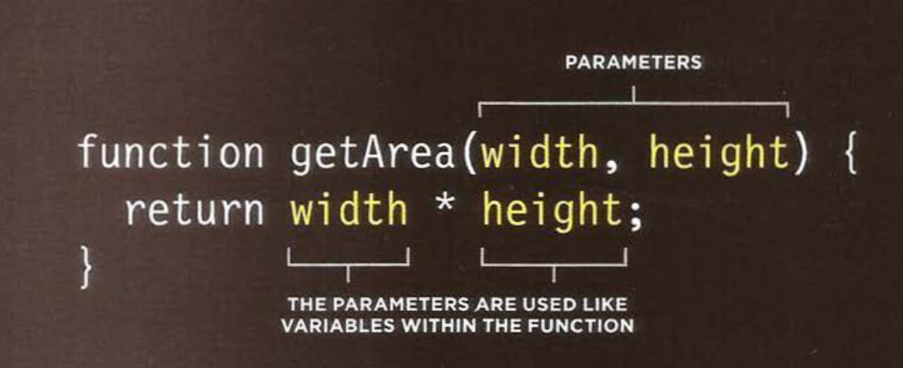

# Programming Concepts Covered

# Class Agenda
- Talk about Functions
- Create a Function 
- Call a Function
- Return a Value from the Function 
- 

# Review of previous class

# Share your learning
3 Programming... Steps to Success ????? 
Discussion Reading...With JavaScript

# Demo: Functions

# Lab: Refactoring
___
# New Vocabulary

### Script
- Js makes web pages more interactive. 
- a. Access to Content( use to grab any html elements on a page.)
- b. Modify Content(add elements, change values of a css class, or change position of img)
- c. Program rules(image script that runs a larger image when a thumb nail is clicked on.)
- d. React to events ( button press, link click)

Script is a series of instructions given to the computer by you the developer, so that the computer can perform some type of task. (Recipes, Handbooks, Manuals)

Writing a script - Humans can easily accomplish complex goals and tasks without thinking about them to much. Computers don't learn how to do tasks, they follow rules explicitly. 
So we start with a big picture to help develop the rules, list of steps, to create a runable executable code. 
1. Define the Goal
2. Design the Script
3. Code each step. 
- Flow Charts 
- List of the Steps. 
Use a programmatic approach to problem solving and achieving goals. Computers need to be told exactly everystep of what to do, and when things go wrong and dont work we have several ways to uncover what happen, through the process of DEBUGGING. 
Programmatically - following a series of steps of instructions, one after another. 

### JavaScript's vocabulary
    https://www.codecademy.com/articles/glossary-javascript

### JavaScript's syntax
    https://www.w3schools.com/js/js_syntax.asp

### Programmatic problem solving


### Expression
- An expression evaluates into (results in) a single value. Broadly speaking there are two types of expressions. 
1. Expressions that assign a value to a variable     //var color = blue;
2. Expressions the  use two or more values to return a single value. //var area = 3 * 2;

### Operator
- Expression rely on things called operators, that allow programmers to create a single value from one or more values. 
#### Assignment Operators // color = blue; assigns a value to a variable
#### Arithmetic Operators // area = 3 * 2; perform basic math
- Addition       +       //Adds a value.
- Subtraction    -       //Subtracts a value
- Division       /       //Divides
- Multiplication *       //Mulitplies
- Increment      ++      //Adds one to the current number
- Decrement      --      //Subtracts one from the current number.
- Modulus         %      //Divides two numbers and returns the remainder. 

Order of Operation for Mathmatics. 

#### String Operators     // greeting = 'Hi' + 'Person's Name'; Combine two strings. 
Only one string operator the '+' sign. Programmers call the process of joining together two strings to create one 'concatenation'.
- Mixing numbers and strings together. (Should show some of this on day 6)
https://repl.it/@tektechnologies/Greeting

- Comparison Operators // buy = 3 > 5;  buy value is false. 
- Logical Operators // buy = (5 > 3) && (2 < 4); Combine expressions and return true or false. 

# What is a FUN FUN function....
___
### Function
A functions lets you group a series of statements together to perform a specific task. If certain tasks need to happen again within the application, then the same function can perform that task instead of repeating the code, in multiple locations, We call this dry code. 
- This helps to organize code. 
Task often run at different times within applications, since some tasks have to wait, we will give them a name so that we can 'call them' later.
- When you ask a function to perfom a task we are 'calling the function' 
- Good Naming would require that we call the function name something that pertains to what it does. 
https://developer.mozilla.org/en-US/docs/Web/JavaScript/Guide/Functions

- Side Note we can also have ANONYMOUS functions. They do not have a name and so they can not be 'called', instead they are executed as soon as the interpreter comes accross them. 
The function above is actually an anonymous function (a function without a name).

Functions stored in variables do not need function names. They are always invoked (called) using the variable name.
var x = function (a, b) {return a * b};
var z = x(4, 3);


So when we are designing a script we need to think about our inputs or information that may be needed to complete the task that the function is trying to perform. 

### Declaration
To create a function we give it a name and then write some statements needed to achieve the task within curley braces {}.
- Declare function using the 'function' keyword. 
- Give the function a name or identifier as it is sometimes called. 
- Write the code statments inside the code block. 



Sometimes we see a function called before it has been declared. This will still work, since the interpreter runs through the script before running the commands, so before executing the statements it reads the code and knows that a declaration appears later in the script. 
___
#### Declaring a function that needs information
Often times we need to process data within a function. In such cases when we declare the function we give it PARAMETERS. If the function needs information or data to work, then we add this data in the parantheis right after the function name. 

### Call
- Now that the function has been declared.
- We can execute the lines of code within the {}
- With one line of code. 
#### This is known as calling the function. 
We use the function name followed bby parathesis. 
FUNCTION NAME - functionName();
functions store the instructions for a specific task. 
When it is done executing the function logic, the code returns or continues to run from the point where it was originally called. 

### Parameters
- Often times we need to give functions information, inorder to complete a task. Pieces of information that are passed into functions are called parameters. 
These words inside the paranthesis, act like variable names



This show's us that the code can perform a task without knowing the exact details in advance. With good 'rules' it can follow and perform tasks. 

### Arguments
- When we call a function that has parameters. We specify the values it should use in the parenthesis that follow its name. 
- These VALUES are call ARGUMENTS. 
- They can be provided as values or as variables. 

Arguments as Values
getArea(4,5); //These numbers act as variables or real numbers
- When called the 4 will act as the width and 5 is the height.

Arguments as Variables
wallWidth = 4;
wallHeight = 5;
getArea(wallWidth, wallHeight);

Often times people use the arguments and parameters terms are often utilized interchangeably. Inside the {} the words act like variables, these names are the parameters. 
- These values that you pass into the code (the data it needs to calculate are call Arguments. )
### Return value
- When we are expecting our functions to give a us a value back after running, the answer or response is known as the return value. 

Let's return a value from a function. 

```function calculateArea(width, height){
    var area = width * height;
    return area;
}
var wallOne = calculateArea(3,5);
var wallTwo = calculateArea(8,5);
```
### Refactoring

Code refactoring is the process of restructuring existing computer code—changing the factoring—without changing its external behavior. Refactoring is intended to improve nonfunctional attributes of the software.
