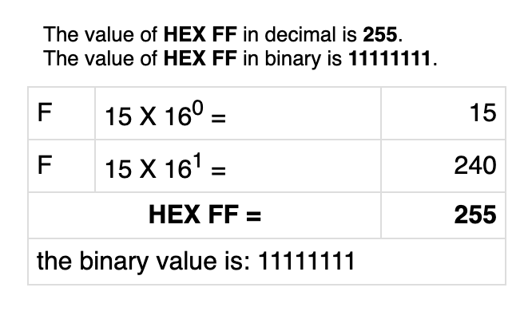
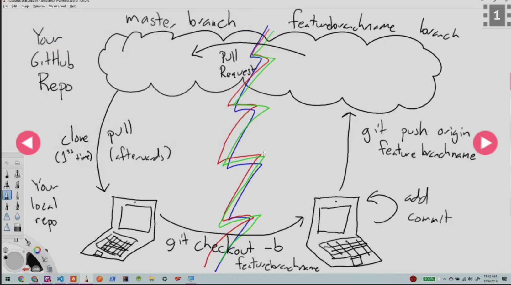

# First Hour

## Announcements

Setup 15 minute 1-on-1 meetings students with each student over the next few days.

## Pair Programming Debrief

## Drawl on white board

- learning from partner while driving
- talking about how code works as navigator is also a skill.
- navigator still has control
- style nitpicks or variable name nitpicks.

## Code Review around 20 Minutes

## Then cover Hexadecimal

## Do Warm Up

## Base 16 and Hex code

134, a normal number.
the one's place, the 10's place and the hundredths place as we move past ten we
add a 1 and then start at 0 in the one's position again.
100 X 1 + 3 X 10 + 4 x 1 = 134
This is a decimal, base 10 mathmatical,

With Computers there are two.

## binary system

## Binary

- are zero's  " 0 "and " 1 "one's, because it is **base 2**.
- we count from zero to 1 and then begin again.
- So we start at the 1's position and then move to the 2's position and then
 the 4's position and then the 8's position, 16th, 32nd place, we multiply 
 by two each time.

128's - 64's - 32's - 16's - 8's - 4's - 2's - 1's . 1/10's (decimal)
                                   1     0     1

## thumbs on base 10

- so if we have a number in binary 101 then that means we have
 **one 1 and zero 2's and one 4's.**

### (1 x 4 + 1 x 1)

That number in binary is what we call 5 in decimal.

(101 === 5).

- We use binary in computers because it is easy for the computer to compute
whether a value is on or off, a 1 or a 0. And we can stick those 0 and 1's
together to make, the numbers we need.

**Binary is base 2.** All zero's and one's. Then move to the next spot over.

## Decimal is base 10. Count 0 - 9

<https://www.binary-code.org/binary/8bit/10000110/>

In binary **decimal points work the same** as in decimal, with usually dont
have to think about those,

## the 1/10's space the 1/2 space and then 1/4 and so on

## HEX code. and RGB Values

so we can specify our desired colors in RGB by the number of red, number
of green and number of blue.

## The number 256 is an important number (16x16) 0r 2 to the 8th

 If we use base 16, we have a one's place and then a 16th's place and then a
256th's place, so all of our possible color values fit into and what that makes
convenient is that all our possible values fit into just two digits of HEXIDecimal.
So we can always use two digits to represent a HEX number, which is how they came
up with Hexadecimal.

### #RRGGBB


 written using a nibble, two are a byte 0-9 or A-F.

---------------------------------------------------------------------------------------------

---------------------------------------------------------------------------------------------

### In base 16 we need something that means the number 10 (0-9 and then A)

#### 0

#### 1

#### 2

#### 3

#### 4

#### 5

#### 6

#### 7

#### 8

#### 9

#### A - 10

#### B - 11

#### C - 12

#### D - 13

#### E - 14

#### F - 15

#### E - 16( We go into Second Place Number)

#### Decimal 16 is equal to 10

#### Decimal 17 is equal to 11

#### Decimal 25 is equal to 19

#### Decimal 26 is equal to 1A

#### Decimal 31 is equal to 1F

This is how Hex codes work.

FFFFFF  is equal to (15 X 16) + (15 X 1) = 255



-

## Convert an RGB to HEX

rgb(184,)

- 184   (16 x 12 = 192 to high)       16 x 11(B - 11) = 176
- 176                   +              1 x  8(8 - 8 ) = 184
       /16              1\
     /2ndPos.        1stPos.\
    16  *11    +     8*    1
          B     +     8         = B8(Hexadecimal )

## Note it is ok, if you can not computate these values by memory

- the google will have resources that will aid in translating values back and forth.



- Start with

- git pull origin main
***To Start work***
- git checkout -b branchName
- git branch
- touch index.html
- touch style.css
- git status
- git add .
- git commit -m 'add initial scaffolding'
- git status
- git push
- git push -u origin branchName

-- go online to create a pull request --

- back at your repo, you will see the pull request for the branch you just pushed.
- After you click on create pull request we can look at the page to see the changes
that we are about to add to our project.
- Once the pull request is created we get a new screen taht will allow us to merge
our pull request to main.
- Once we have the code merged to our main we can refresh our repo page and see
the code merged into the project.
- Next we need to go back to our local bash, and we will update the branch that
we just merged and switch back to our main branch, which will not have the code
that our project in the cloud contains. So,

- git checkout main
- git pull origin main
- Create a new branch for our next function,
- git checkout -b functionTwo
- git branch - two check branch status.
- Now we can work on a new branch and add new unique code.

Lab 5b

- Start with forking the repo, and everyone will start with the demo code.
- The starter code has directions to follow.
- Everyone lets go ahead and go through this together. Let's fork the project.

## TA will provide feedback within github pull requests, as well as grading in class

We have that history for review, each commit has a hash, it is base 16, although
it is still really long, we can run in command git checkout and that hash number.
This allows us to go back in time and look at the code how it was in the past
throughout its development. Now if we look at the code we are seeing the code
before the commit was made.

- git checkout main takes us back to main.

### Git branching & deployment

- **Why**
    - Branching allows each developer to branch out from the original code base
     and isolate their work from others.
    - Allows all risk involved in a merge to be deferred until that point.
- **What**
    - Branches represent an isolated line of development.
- **How**
    - Use a whiteboard to demonstrate branching.
    - Demonstrate using a project that you may have onr your local machine.
        - Create and checkout to a branch.
    - Demonstrate the pull requests and merging the branch back into main.

## Second Hour

## Warm up

- Have the students take a couple minutes to answer these questions.

1. What is a function?
2. Why do we write functions?

### What is a function?

- procedure
- Contains a set of statments that perform a specific tasks.
- functions usually describe a task that we do
- it is a named piece of code.

- eventually our function will do most of our heavy lifting for our applications.
Functions often look similiar and do similiar things. For instance, database
connections, even if the data base is different language, the connections often
look the same, there are differences in snytax. Sometimes we have to write functions
that have never exsisted to solve some problem or algorithm.

### Why do we write functions?

- Makes code Dryer. (less copy and paste)
- Call the code over and over.
- Make code more readable for other developers.
- Use functions when we want to reuse a section of code many times.
- So when I do something multiple times, I realize I have a piece of behavior that
 needs to happen more than a few times, is when I realize it.

### How do we write functions in our code

- figure out what I want to do.
- figure out what inputs and outputs I will have
- Last step is writing the function.

## This follows our class 5 from 102

- We dont just jump into code.

1. Talk about it. //Read the assignment.
2. Learn about it. //Place technical requirements in comments.
3. Then code it. // complete a requirement and commit on branch that you can create
 a PR on. first we need to figure out what the problem is and then we can start to
build out our functions.

## adding names to anonymous functions/show the outcome in the stacktrace in console

- We want to build out functions in a couple of differnet ways. For one, we may
be working on a block of logic that does something and may eventually end up in
a function where this named peice of code, can then have its parameters determined
and can be called over and over.

- So lets write a function that prompts a user for a pizza crust.

## '1'

```js
//This will return undefined. Because our variable scope is within the function
//where the variable is declared. 

function pizzaCrustType() {
   let pizzaCrustType = prompt('What type of pizza crust would you like?');
   console.log('Customer Pizza Crust Type is: ' + pizzaCrustType);
}
pizzaCrustType();
```

```js
console.log('Your Pizza Crust Type is: ' + pizzaCrustType);
//This will return undefined. Because our variable scope is within the function
// where the variable is declared. 

```

## '2'

```js
let pizzaCrustType;
function pizzaCrustType() {
   pizzaCrustType = prompt('What type of pizza crust would you like?');
   console.log('Customer Pizza Crust Type is: ' + pizzaCrustType);
}
pizzaCrustType();
//We dont always need access to global variables all the time, best practice is 
//to keep your variables as local as possible.
```

## '3'

```js
let sandwichType;
let pizzaCrustType;
function pizzaCrustType() {
   pizzaCrustType = Number(prompt('What type of pizza crust would you like?'));
    if(pizzaCrustType < 2){
        confirm('You would like to try our thin crust style pizza?');
    } else if(pizzaCrustType >=2 && pizzaCrustType <= 5){
        confirm('You would like the Deep Dish Chicago style pizza?');
    } else if(pizzaCrustType > 5 && pizzaCrustType <= 10){
        confirm('You would like the Detroit style pizza?');
    } else {
       confirm('You want the italian meat ball sub sandwich?');
       sandwichType = 'MeatBall Sub Sandwich';
    }
    return [pizzaCrustType , sandwichType];
}
// We can remove this and call it in the console.
pizzaCrustType();
//run function then see the return value in the console and then run the log to
// see the value used.
    console.log('Customer Pizza Crust Type is: ' + sandwichType);

```

- So when we initially called the function it displayed some output, with the
 return the variable value this then provided for use throughout the rest of the
 code, if needed.
- This variable will **hold the value for the one time that the function was run.**

### Return gives back the output and then we add it to a variable for later use

- Getting back an answer is what allows the program to do the task that they are
 designed to do.

## Returns are much more useful than console.logs too

## '4'

```js
function lotteryNumberPicker(){
    //Start by creating array for the numbers
    let lotteryArray = [];
    //Set the first number in the array to be 10
    lotteryArray[0] = 10;
    //Run 5 times to get five random numbers.
    //So lets use a loop
    //we can write with a for or a while loop. 
    for(let i = 0; i < 5; i++){
       //lotteryArray[i] = Math.ceil(Math.Random() * 99);
       //A method on arrays that allows us to put value o the end of arrays called push
        lotteryArray.push(Math.ceil(Math.random() * 99));
    }
    //pick one number and return it. 
   return lotteryArray;
}
```

```js
function lotteryNumberPicker(){
    let lotteryArray = [];
    lotteryArray[0] = 10;
    for(let i = 0; i < 5; i++){
        lotteryArray[i] = Math.ceil(Math.Random() * 99);
    }
   return lotteryArray;
}
```

- If we move the array variable outside of the function it will continually save
 the random 5 numbers each time the functin is run.

### We have now specified output from a function

### So now lets look at how we handle input

## Do this in review

So lets pick some numbers and we will specifiy these numbers in the function
 using parameters.

```js
function lotteryNumbers(quantity, lotteryMax){
    let lotteryArray = [];
    for(let i = 0; i < quantity; i++){
       //lotteryArray[i] = Math.ceil(Math.Random() * 99);
        lotteryArray.push(Math.ceil(Math.random() * lotteryMax));
    }
   return lotteryArray;
}
```

```js
function lotteryNumbers(quantity, lotteryMax){
    let lotteryArray = [];
    for(let i = 0; i < quantity; i++){
    console.log(i); 
        lotteryArray.push(Math.ceil(Math.random() * lotteryMax));
    }
    console.log(lotteryArray);
   return lotteryArray;
}

let lotteryQuantity = Number(prompt('How many numbers would you like?'));
let lotteryMax = Number(prompt('What is the Max amount per number?'));
alert(lotteryNumbers(lotteryQuantity, lotteryMax));
```

## Third Hour

### Images, Color, Text

- **Why**
    - Images, font color, and text are a great way for students to style their applications.
- **What**
    - Images
        - JPEG (.jpg, .jpeg)
        - GIF (.gif)
        - PNG (.png)
- **How**
    - Image Demo:
        - Discuss the advantages and disadvantages of the different image file
         formats listed above.
        - Can use VSCode for image demo - build out HTML and CSS pages.
        - Add image in HTML along with other HTML elements like `<p>` or `<article>`.
        - Style figure and show different ways you can resize image.
    - CSS Color / Font Demo:
        - Using the same CSS file that was used in the Image demo, show how to 
        style the `<p>` or `<article>` elements.
        - Style text using `font-family`, `color`, `line-height`, and `font size`.

### Lab prep

- **Why**
    - Provides students with the tools to be successful with their lab.
- **What**
    - Review Lab 05a, 05b, and 05c instructions in Canvas.
- **How**
    - Lab05a review:
        - Code out the first problem with students so they have an understanding 
        of what is asked of them.
        - Confirm what the function needs to return to meet the test requirements.
        - Point out after question 2 they are NOT allowed to use the arthmetic operators.
        - Students should not touch the test file!
    - Lab05b review:
        - Point out where they should be navigating to in GitHub for deployment.
    - Lab05c review:
        - Walk through a few of the first questions in CSS Diner.
        - Advise students they will need to take a screenshot of the menu once completed.

#### Student Code

```js

function questionTwo() {
let userCorrect = false;
let bands = ['bon jovi', 'guns and roses', 'tesla', 'motley crue', 'cinderella', 'kix', 
'def leppard', 'poison', 'warrant'];
let guesses = 0;

while (guesses < 7) {
let eighties = prompt("In the 80s, I loved hair bands.  Name a hair band and I will 
let you know if it was one that I liked.  Go!").toLowerCase();
  for (let i = 0; i < bands.length; i++) {
    if (eighties === bands[i]) {
      console.log('You guessed right.');
      alert("Bang your head!  Way to go!\n\nHere are the bands that were my top picks:
        Bon Jovi, Guns and Roses, Tesla, Motley Crue, Cinderella, Kix, Def Leppard,
         and Poison.");
      alert(user + ", thank you again for visiting my page!");
      guesses = 7;
      userCorrect = true;
      break;
    }
  }
  if (guesses !== 7) {
    alert('That is not one. You\'re not the very best, but try again!');
    console.log('User response is ' + eighties + ' to question 6');
  }
  guesses++;
}
    if (userCorrect === false) {
    alert("Keep practicing your cowbell!\n\nHere are the bands that were my top picks:
      Bon Jovi, Guns and Roses, Tesla, Motley Crue, Cinderella, Kix, Def Leppard,
      and Poison.");
    alert(user + ", thank you again for visiting my page!");
    }
}

```
