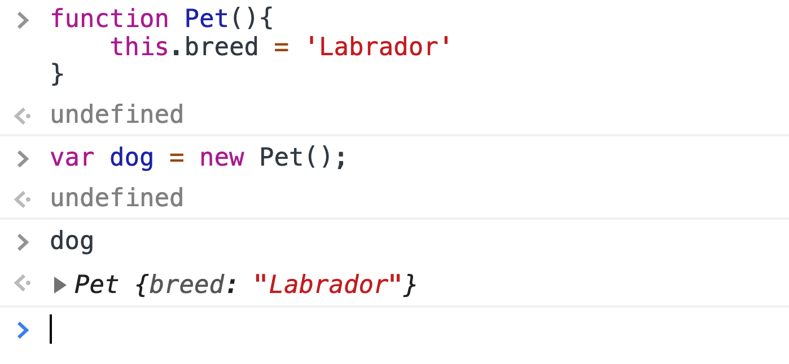
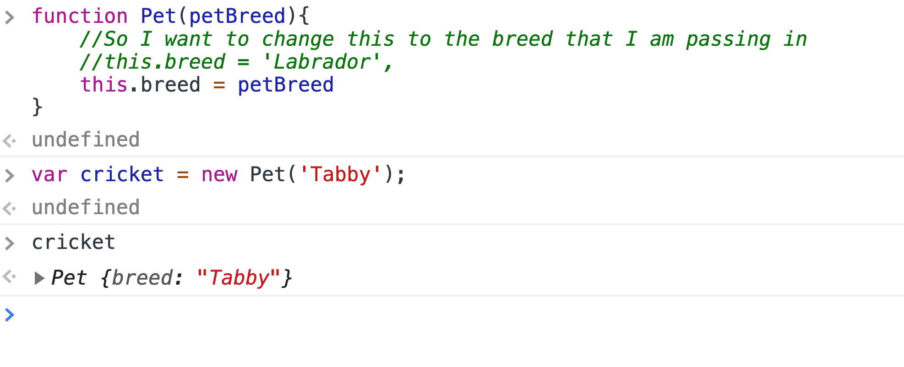
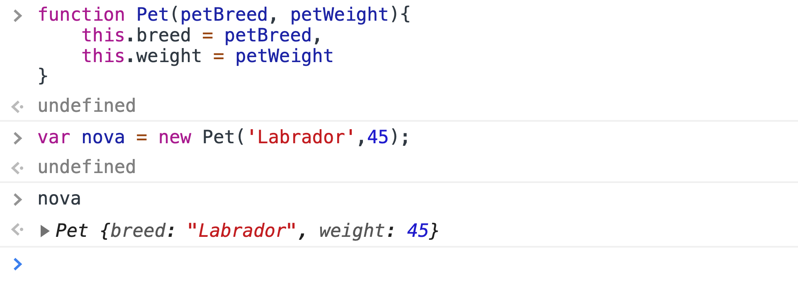

# First Hour

## Agenda for Today

- Constructor Functions
- ProtoTypes (Inheritance)
- Template literals
- new operator
- html Tables
- google fonts

- Code Review

- This weeks project is meant to take all week
- with new implementations to our problem domain
- we will look at the code possibly refactor some code
- What was the one thing that you found hardest?

- Code review topics

    1. How to do cookies per hour at each location.
    2. Sales amount in each city( adding things to the page)
    3. id in html, then put other things into that from js.
    4. ~ how to do css from js.

## Look at Git Repo and notice the differences

- What do we notice from the student repo.
    1. latest commits
    2. different branches
    3. different commits
    4. We can see that the different commits show that work being added over time.
    5. Watch out for **CAPITALIZATION.**
    - Computers,  go to a terminal on your machine, wsl, cd wr,
    - the issue is that it is not true on Linux, capitalization matters,
    - so when we deploy our code to git hub, that runs on linux,
    - we want to keep things standardized, with lower case.
    - 90% of sites online are running on linux.

- What data type is the Seattle variable. === Object
- Using what to store our data            === Key / Value Pair.  

***MustDoThis***

- Show the running total with the debugger

## Did they use a render method

- We will look at how to create html elements
- that we will append to our UL and LI items, in order to create child/parent relationships.

```js
let allStores = ['storeOne','storeTwo'];
```

- There is a lot of potential for DOM manipulation and JS objects.
- We could make a `render` method on one of the JS
- objects that can render these new HTML tags as a list to our page when called:

- Question how was it creating each object literal?

## How would you feel if you had to type out another 250 stores, by hand from paper

- So since these are all the same object literals there are ways,
- to automate this process. how you ask?

## Constructor Functions

- With code constructors, instead of object literals.
- Which is what lab 7 will be on.
- currently we have about 15 - 25 lines of code, x 250 objects.

- So, with a constructor we can create objects, with a max of 15 lines(once)
- and we can add one line of code to 15 define each city and one to create store
- this scales better the more objects we get, Constructors are powerful tools,
- for developers, in that we write less lines of code and have less of a chance
- to make mistakes, while coding out our problem domain.

## Second Hour

### Take Break 10 Minute

**Back to our Demo. In the Console Run Code**   At 10:00am

## Constructors or Constructor functions

- it is a function
- it has a specific job to set up objects. (with specific properties(AKA keys))
- Upper Camel Case for the Name.
- Call with the word "new"  , new is built in key word of javascript.
- Constructor names tend to be a singular noun.
- This is how we define a constructor function.  

```js
//function key word and capitol letter on the function name.
function Pet(){
    //code goes here.
}
```

1. Other than the capital letter there is no difference with any other function.
2. So now inside the constructor, set up the properties we want for our objects
3. We need key/value pairs on the new object.
4. Using constructor functions we gain access to use the contextual this.

```js
//not a great example!
function Pet(){

    this.breed = 'Labrador';

} //show the "function" first.
```



- Console.log to create a new Pet:
- let buddy  = new Pet();
- type buddy  to see the new Pet object,
- notice that it say's Pet outside the object braces.
- Try a different dog,
- console.log is something we write some times.
- What do we do  =  when we want to give a function information?
- In general if we have a function
  and we want to provide information to those functions.
  We pass inbetween parathesis.
- What do we call those thing in the parathesis.?????????????
- We call them parameters, to give the function information so that it can run.
- So, we will take in the values that we want as parameters to out functions.


```js
function Pet(petBreed){
    //So I want to change this to the breed that I am passing in 
    //this.breed = 'Labrador',
    this.breed = petBreed;
}

```

- Which means now that I need to pass in an argument to the parameter for petBreed.
- So, now in the console I can type

```js
let cricketCat = new Pet('Tabby');
```

```js
function Pet(petBreed, petWeight){
    this.breed = petBreed;
    //Name of parameter and name of property can be the same or different.
    //this.weight = weight;
    this.weight = petWeight;
}
```



- Now go back to the console and pass both parameters in.

```js
let buddy  = new Pet('Labrador', 45);
```

## Prototypes

1. To move functions out of constructor functions
2. Use prototypes to make the methods accessible for the object created.
3. Every object has a prototype.
   - It can be assigned explicitly, or is set to the global Object by default
4. All objects have the props & methods of their prototype
5. If a prop or method can't be found on the object itself,
    - the JS engine will look up the prototype chain for it.

- There is a lot of potential for DOM manipulation and JS objects.
- We could potentially make a `render` method on one of the JS objects.
- that can render these new HTML tags as a list to our page when called:

```js
render: function(){
  let parent = document.getElementById('parentElement');
    for(let i=0; i < people.length; i++){
      let newTag = document.createElement('li');
      newTag.textContent = myArray[i];
      parent.appendChild(newTag);
    }
}
```

## Third Hour

- Take Break 10 Minute

- So we have methods in the object literals that we want to make accessible
- for our other pets methods and behaviors.

## Take this function as an example

```js
function Pet(petBreed, petWeight, petInterests){
    this.breed = petBreed;
    //Name of parameter and name of property can be the same or different.
    //this.weight = weight;
    this.weight = petWeight;
    this.description = petInterests;
}
```

So the methods that exists within the pets

- next step is to take the getInterests function and make it accessible for
- every pet so we have an exact piece of code to set up for this to work

 ```js
Pet.prototype.functionName = function(any, parameters, go, here){};
```

Benefit is that with any pet that we create will have access to this function.
Technical description takes about three hours of lecture to get through, so we
will just trust that this will work, so that all the pet objects we create
will have access to these functions, so lets focus on what functions our objects
need and then accept the auto magically, the stuff that prototypes do for us.

```js
Pet.prototype.getInterests = function() {
//The code that goes in here is already using contextual this,
// so it will work here for us as well. 
//Create a random index within the pet description array. 
let randomIndex = Math.floor(Math.random() * this.petInterests.length);
//Use that random index, to go into the array and grab a description.
return this.petInterests[randomIndex];
};

Pet.prototype.getInterests = function() {
let randomIndex = Math.floor(Math.random() * this.petInterests.length);
return this.petInterests[randomIndex];
};
```

- So, now lets take the firstPet

```js
    let firstPet = new Pet('Labrador', 45, ['Playful','Hungary','Sleepy']);
```

```js
function Pet(petBreed, petWeight, petInterests){
    this.breed = petBreed,
    this.weight = petWeight,
    this.petInterests = petInterests
}

Pet.prototype.getInterests = function() {
let randomIndex = Math.floor(Math.random() * this.petInterests.length + 1);
return this.petInterests[randomIndex];
};

let firstPet = new Pet('Labrador', 45, ['Playful','Hungary','Sleepy']);
firstPet.getInterest();
```

## Inheritance example

```js
function Animal(species, legs){
    this.species = species;
    this.legs = legs;
}
Animal.prototype.sleep = true;

function Pokemon(name, type, legs){
    Animal.call(this, "pokemon", legs);
    this.name = name;
    this.type = type;
}

//allows prototype to share values
Pokemon.prototype = Animal.prototype;

let pokemon1 = new Pokemon('Pikachu', 'electric', 2);
console.log(pokemon1);


```

## If we don't know the parameter, we write null

- we don't leave it blank because we get syntax errors,
- so use null, however if we do math on say weight and there is a null you will
 get back a NaN, response.

## INSTANCES OF AN OBJECT

- We may also call these objects pet instances. Any time we call the constructor
 we use the new and the name of the object constructor, and then provide arguments
 for the constructor.
- Remember..... The prototype allows us to create methods accessible by any
instance or any object being created by the constructor function, in the console
we can call getInterests, now all pets have access to the get description function.
 Now we can add as many pets as we want and they will all have access to these
prototype methods.
- Add another pet and it works because of us using the contextual this, we can
access the description words of that specific pet object.

## Now do the tables

- One other part of your lab for today, is HTML tables.
- So, lab tasks say we should implement a constructor function, instead of the
 object literal.
- Change out lists of data to tables of data.
- Which is how we will build out these tables of data.
- I advise that you do the constructors first and then build out the tables,

## Do not try and build the entire lab at once

- make sure to create our lab 7 branch and commit as soon as you complete a feature.

## DEMO TABLES

- So to start lets look at tables in the HTML
- A table tag encloses the rows and cells of our table.
- So, inside the table we want to add a table row, and inside the table row we
will have a cell tag called a

```html
<td></td>
```

Each table row is defined with the

```html
<tr>
```

 tag. A table header is defined with the

```html
<th>
```

 tag. By default, table headings are bold and centered. A table data/cell is
 defined with the

 ```html
<td></td>
```

tag.

- Tables are not good when it comes to mobile design.

```html
<table>
    <thead>
        <tr>
        <th>Hours</th>
        <th>Location</th>
        <th>Contact</th>
        </tr>
    </thead>
    <tbody>
        <tr>
        <td>8am-5pm</td>
        <td>Cedar Rapids</td>
        <td>555-555-5555</td>
        </tr>
    <tbody>
</table>
```

```css
th td {
    border: 1px solid grey;
}
```

- watch out for addition td tags being displayed that will mess up the table order.
- It allocates space by the content within the cell, tables are not good at being
 styled and even worse with mobile app. Tables are being styled by the browser.

### Let's create some tables now in our javascript

- Writing tables in html is a bit heavy,
- So lets add a table to store pet data.
- So typing out our tables can be time consuming and more keystrokes than if we
 let our javascript, build the table for us.
- So for each of these pets, I want to display a
- Add table to pet-holder -
- Then I am going to add a table.
- With a table row header with breed, weight, and description of that pet is.

```html
<table id="pet-table">
<tr>
    <td></td>
    <td></td>
</tr>
</table>
```

- So when we refresh it will have a single row with the titles for our columns.
- So I am going to add them to the table
- the way that I am going to do that is use creating a render(). on each of my pets.
- Add prototype method to add pets to the table.
- The render() method will allow me to render my pets to the page into a table.

```js
Pet.prototype.render = function() {
    //grab table from the page the id.
    let petTable = document.getElementById('pet-table');
    //Create the td and tr that will hold the data for this particular pet. 
    //How do we nest html elements in the page. 
    //So make a pet row. a TR 
    // And that tr needs to hold some td's
    let petRow = document.createElement('tr');
    let breedCell = document.createElement('td');
    //Set text content to the breed of the object,
    // how do we access the breed for the object we are referencing we use this
    breedCell.textContent = this.petBreed;
    //Now take the piece of data that we created and append it to the row as a child
    petRow.appendChild(breedCell);
    
    let weightCell = document.createElement('td');
    weightCell.textContent = this.petWeight;
    petRow.appendChild(weightCell);

    // Also add a description.
     let descriptionCell = document.createElement('td');
    descriptionCell.textContent = this.petInterests;
    petRow.appendChild(descriptionCell);

    //Add to page by appending the Table. 
    animalTable.appendChild(petRow);

// Pet.prototype.render = function() {
//     let petTable = document.getElementById('pet-table');
//     let petRow = document.createElement('tr');
//     let breedCell = document.createElement('td');
//     breedCell.textContent = this.petBreed;
//     petRow.appendChild(breedCell);
//     let weightCell = document.createElement('td');
//     weightCell.textContent = this.petWeight;
//     petRow.appendChild(weightCell);
//      let descriptionCell = document.createElement('td');
//     descriptionCell.textContent = this.petInterests;
//     petRow.appendChild(descriptionCell); 
//     animalTable.appendChild(petRow);
// }
};
```

- Now is when we run firstPet.render();
in the console it add the information to the page.
- petTwo.render()
- petThree.render()
- Any object instance being created will have access to the render method by way
of the prototype. Because it is a prototype method, all pets using the pet
constructor will be able to call this function.

```js
for(let i = 0; i < adoptPets.length; i++) {
let newParagraph = document.createElement('p');
//set text content with template literals.
newParagraph.textContent = `A nice kitten to code with is  ${adoptPets[i].name} 
 because they are good at ${adoptPets[i].interests} .` ;
petParagraph.appendChild(newParagraph);
}
```

- We will update too:

## Use and IIFE

```js
(
for(let i = 0; i < adoptPets.length; i++){
    pets[i].render();
}
)();
```
