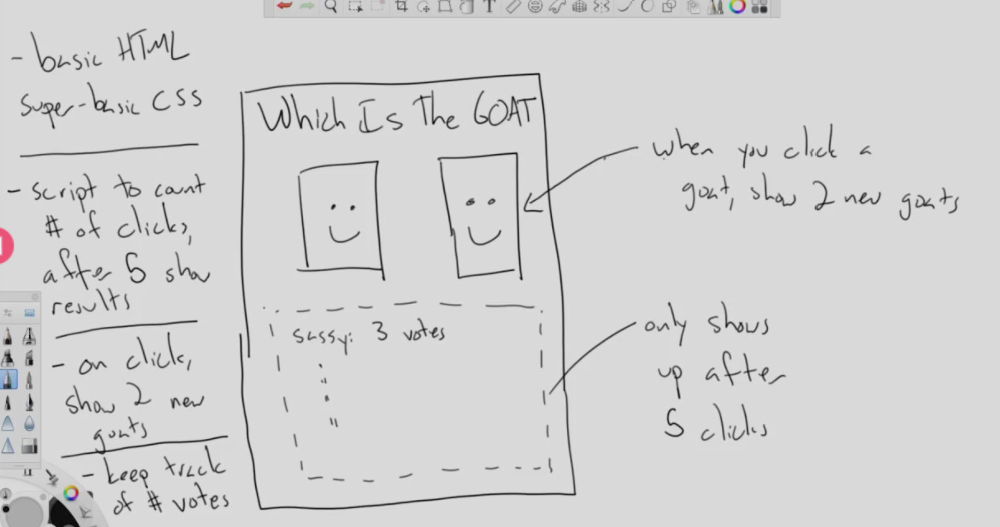

# Programming Concepts Covered


# announcements
Locked out assignments are intentional, to the point that if you have missed it, you should probably be focused on something else, we are not stopping you from reading, but, be aware that readings pertain to the relevent topics of the day, 4 skills in language learning: Hearing, speaking, reading, writing, when we focus on specific material while doing this we learning faster and looking at specifics becomes less arduous. 


# agenda

1. Look at final project requirements. 
2. Final Project Key Elements (In Scope)
    - forms
    - event listeners
    - local storage (3rd Week)
    - chart.js (3rd Week)
    - font awesome

3. Out of Scope. 
    - login (local storage ok) admin view prespective as opposed to client view. 
    - database
    - server 
    - network requests
    - jquery
    - bootstrap
    - 3rd party library's front end tools talk to me first. 
    - Be aware of using CDN's for longevity of your project. 


#### Project Example 
    https://github.com/sajafisher29/Adulting101

# Teams put together by Class 12.

#### Chocolate Pizza Get some copies of the submissions for code review. 
- find a friend and get the papers. 
- which code goes with which site. 
- what would you modify on these sites. 

- One of them has check boxes the other doesn't font types are different. 
- Go through and point out what dont you understand, or if there is another way to do it, or what would work better. Take 10 minutes to read through the code. 
- do a code review, on the code in front of you. 
- If this is your code, then review another's.


- Watch spacing maybe set font size to zero on spaces that html adds into the page. 
- manage your css declarations and keep them to a minimum per selector if possible. 

- Manage mobile view, if it looks good at 960 your fine, in 301 we will talk more about mobile sites and how to structure them. 

## Now lets take a look at a code demo of some audio and video. 
- We know we can embed an image into a page. 
- So we have a prebuilt site, in order to jump right in. 
- Lets look at what this demo does. 
- We have an audio tag with a source with several attributes. 
- Set to be muted by default. auto play not allowed. 
- Video in general should not be auto played, chrome will check for the auto to be off. 
- Controls - adds an attribute to show the menu for users to control the audio. 
- 
- In the console type 

```js 
document.getElementbyId('leaves');
//show the audio tag,  now set to var
var audio = document.getElementById('leaves;');
audio.play();
//plays the audio
// how do we make it stop?
// audio.stop()?
audio.pause()

```


### White board the code suggestions. 
- Demo the change sound button. 
### What do you think this javascript looks like for a button like this. 
- Math.random()?
- set as the volume of the audio element.
- grab the button by id ? 
- probably belongs to a function 
- add an event listener // listen for click event. 

we can add another event listener here that does this. 

randomizer.addEventListener('click',function(){
    console.log('You clicked the volume button.');
})


# Video 
- works like images and audio 
- make a video and give it a source. 
- you can set multiple source formats for the browswer so that it will find a suitable format to play. 
- Usually from high def to lower res. 
- Same controls attribute, and thusly we get controls. 
- you can use auto play / which chrome will block unless it is muted. 
- we can set a height absolute
- width can be a percentage

- That is most of what our introduction to video and audio will be for now. 
- What questions do you have about audio and video. 
 **Thumbs how do you feel about putting a video into your projects**

 # Start Vote Tracker
 - Begin with the Lab in Canvas. 
 - Explain the Problem Domain the Bus Mall
 - Show the final solution for the lab today. 
 - click, record, console, 3 new images.
 - once we click through 25 of these it will list out the results. 
 - What questions do you have about this lab? 

 #### in repo

 + Pizza vote. 
 - So today's lab requires no new concepts, but you will have to use the skills you learned in new ways, and with the build out of a new project you should take some time to plan out the assignment. 
 - We will start the demo with a wireframe of our pizza 
 - Start with the basic html
 - Start with the basic css 
 - only shows up after 5 clicks
 - script to count 5 clicks 
 - keep track of votes

 


- build out intial scaffolding mention that this is a good time to commit and start you git acp flow. 
- So to start out with I want to add some images to build the initial framework for the page. 
- I may or may not remove the elements once I get my javascript set up. 
- So lets set up some CSS to style those images. 
- I dont need perfect CSS yet, but I can frame out what will come using semantic elements. 
- I could continue to build out CSS and HTML, but I should switch over to building out some js too. 
### Questions so far?
#### Lets make another commit. 

- These 3 pieces of the script can be done in any order .
- So in our javascript .
# 2. On click show two new goats. 
//set up images to call that function when there is a click. 
```js
//create a function to store clicks
function imageWasClicked(event){

console.log('image was clicked');
}

var imageElements = document.getElementByTagName('img');
for(var i = 0; i < imageElements.length; i++){
    imageElements[i].addEventListener('click', imageWasClicked);
}
// Also link javascript. 

// check to make sure go click on the pic it will fail because we have not added an id to the imgs yet. 
```
- add debugger to look at event after console log. to find event dot source element, that will give me an image tag, something I can access directly. What ever is clicked on is the source element. what can we do with that. We could add an id, that would work. but lets get fancier, lets add an id, 1,2.
- Now I can grab event.srcElement.id and it will tell me the id number. 
- when we keep track of what images were stored where, 
- Just keep track of how many each image was clicked, 

# 3. Keep track of Votes.

var img1Clicked = 0;
var img2Clicked = 0;

```js
//create a function to store clicks
function imageWasClicked(event){
 if(event.srcElement.id === '1'){
     img1Clicked++; 
 } else if(event.srcElement.id === '2'){
     img2Clicked++;
 }
}
```
- console.log img1Clicked to see how many times it was clicked
- and then do img2Clicked to count up the total that we are tracking. 
- So now handle the five clicks 
# 1. Script to count number of clicks. != > 5 clicks.
```js 
if(img1Clicked + img2Clicked >= 5){
    //we made it to five clicks. 
    var footerElement = document.getElementByTagName('footer');
    footerElement.textContent = You picked Pizza 1 ${img1Clicked} times and Pizza 2 ${img2Clicked} times.';
}
```


- Track data of each individual Pizza, 
- So we could put them in an array. 
- keep track of image url and clicks along the way, 
- So, several variables. 
- Create an array with object with each pizza 
- So lets make a constructor for our Pizza's 

```js
function Pizza (name, imageURL){
    this.name = name;
    this.imageURL = imageURL;
    this.timesClicked = 0;
}

//Now lets create the goat. 
new Pizza('Thin Crust', /images/newYorkPizza.png)
// create more. 


//Now create the array to store out objects 
var allPizzas = [];
//go to console see the goats after typing allPizzas
```

 
- Now I need to pick two random Pizzas to display. 
- Start with a variable
```js
var pizzaIndex1 = Math.floor(Math.random() * allPizzas.length);
var pizzaIndex2 = Math.floor(Math.random() * allPizzas.length);
```
- Time to show these on the page. 
- grab image elements at the top of the page. You can use loop through for event listener and inside the display code.
```js
//need to change to the URL attribute src
imageElements[0].something = allPizzas.[pizzaIndex1].imgURL;
//and do number 1
imageElements[1].src = allPizzas[pizzaIndex2].imgURL;
```

- Images now update but it will show duplicates. so lets handle the validation of the demo. 
- keep the same one from showing up and keep from the last one from showing up as well. 
- this handles dups from showing up. most of the time.
```js
while(pizzaIndex1 === pizzaIndex2){
    pizzaIndex2 = Math.floor(Math.random() * allPizzas.length);
}

```


- we need to keep track of the goat being displayed. so we can track how many times they show up and how many times they were clicked. 


```js

  // pick 2 random goats to display
  var nextGoatIndex1 = Math.floor(Math.random() * allGoats.length);


  while((nextGoatIndex1 === goatIndex1) || (nextGoatIndex1 === goatIndex2)) {

    nextGoatIndex1 = Math.floor(Math.random() * allGoats.length);


  }


  var nextGoatIndex2 = Math.floor(Math.random() * allGoats.length);


  while((nextGoatIndex2 === goatIndex1) || (nextGoatIndex2 === goatIndex2) || (nextGoatIndex2 === nextGoatIndex1)) {

    nextGoatIndex2 = Math.floor(Math.random() * allGoats.length);

  }


  // now that we have the old numbers to avoid duplicates we can set pizza index to get the next // this will update the last images shown so that when the new random images are generated they can be validated against the last showing. 
  pizzaIndex1 = nextPizzaIndex1;
  pizzaIndex2 = nextPizzaIndex2;

```

- set up pizza in a variable

These are the first two pizzas to show. 
 var pizzaIndex1 = 0;
 var pizzaIndex2 = 1;


- now switch up the nextGoatIndex1 and nextGoatIndex2 
#### Something is broke at this point. maybe. check the pizzaIndex2 naming. 

- So go into our function to increment correctly on everything was clicked. 

- inside the imageWasClicked(event)
- add allPizzas.pizzaIndex1.timesClicked++;
- and in th if for pizza two do the same. 
- goats now know how many times they have been clickd on. 
- Now loop through all the goats and display how many times each one was clicked, 
- currently you have most all of the logic you need for today's lab. 


# 3. Keep track of Votes.

var img1Clicked = 0;
var img2Clicked = 0; 
- we are not keeping track of the individual clicks here anymore so lets update this to 
var totalClicks = 0;

- then in the event listener for the imageWasClickedFunction 
- totalClicks++; 

- then change if total clicks > 5
- Update the footer return

- Make sure to build your app from scratch. 
- do not start with this. 
- plan your project. 
- good practice for next week to build things out bit by bit. 
- What questions do you have? 
