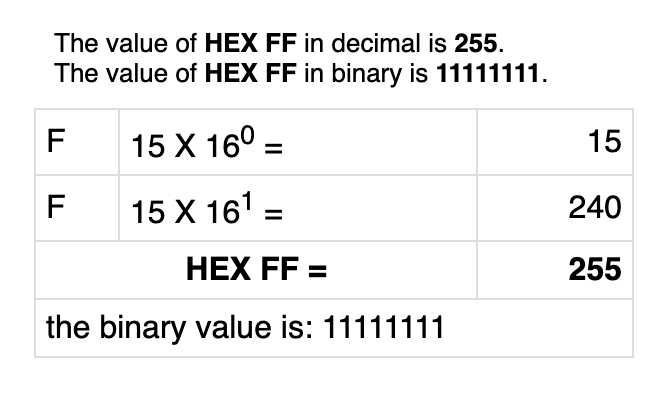
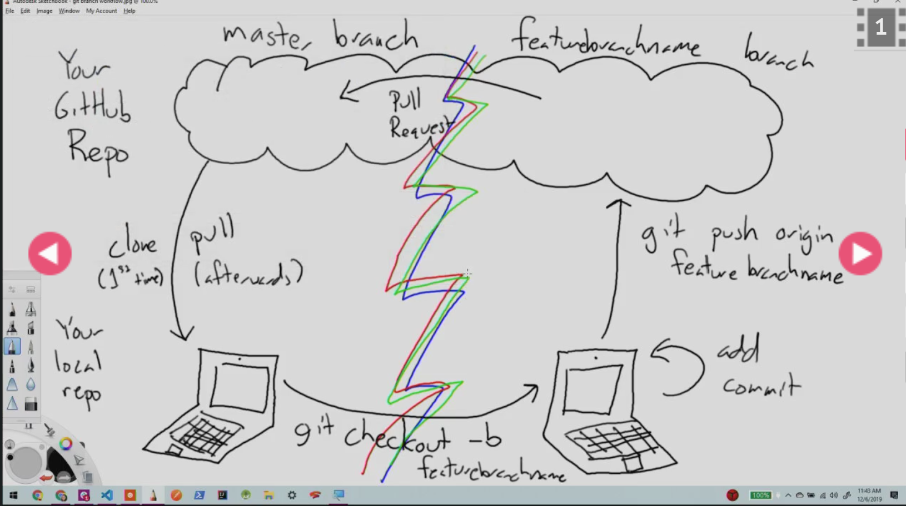

# Programming Concepts Covered
## Today's Schedule

- [Readings and various topics](#readings) 
- [Various topics](#smattering) 
- [Git Branching, including deployment](#git) 
- [Lab Overview](#lab) 

## Announcements
Setup 15 minute 1-on-1 meetings students with each student over the next few days. This will be your opportunity to check in with them individually to check where they are at and how they are doing in the course so far.
# **Reminder:** 
- Weekly surveys will go out to students in email. Your survey responses are very helpful and meaningful to us. **Feedback is a gift.**
	- The instructor will have a 15-minute one-on-one meeting with each student during the coming week: this will be an opportunity to review your progress, answer any questions you have, and discuss any topics the instructor sees appropriate, such as your future plans in the program. We will start the process of scheduling those meetings very soon.

 

## Pair Programming Debrief
## Drawl on white board.
- learning from partner while driving
- talking about how code works as navigator is also a skill. 
- navigator still has control
- style nitpicks or variable name nitpicks. 

# Code Review around 20 Minutes then cover Hexadecimal and then finsih review

1. Look at web page, check out the css, and how its working. 
# Make sure every one has an eslinter on their About Me.
- Show them how to identify, errors in the code, the left side bar shows little red boxes. We can fix those issues with hovering over the red lines, and selecting the "fix all" options. 


# Base 16 and Hex code. 

134, a normal number. 
the one's place, the 10's place and the hundredths place as we move past ten we add a 1 and then start at 0 in the one's position again.
100 X 1 + 3 X 10 + 4 x 1 = 134
This is a decimal, base 10 mathmatical, 

With Computers there are two.
### binary system
## Binary 
- are zero's  " 0 "and " 1 "one's, because it is **base 2**. 
- we count from zero to 1 and then begin again. 
- So we start at the 1's position and then move to the 2's position and then the 4's position and then the 8's position, 16th, 32nd place, we multiply by two each time. 

128's - 64's - 32's - 16's - 8's - 4's - 2's - 1's . 1/10's (decimal)
                                   1     0     1
## thumbs on base 10.

- so if we have a number in binary 101 then that means we have **one 1 and zero 2's and one 4's.** 
# (1 x 4 + 1 x 1) 
That number in binary is what we call 5 in decimal. 
(101 === 5). 
- We use binary in computers because it is easy for the computer to compute whether a value is on or off, a 1 or a 0. And we can stick those 0 and 1's together to make, the numbers we need. 

**Binary is base 2.** All zero's and one's. Then move to the next spot over. 
# Decimal is base 10. Count 0 - 9. 
 
https://www.binary-code.org/binary/8bit/10000110/

In binary **decimal points work the same** as in decimal, with usually dont have to think about those, 
# the 1/10's space the 1/2 space and then 1/4 and so on. 

# HEX code. and RGB Values. 

so we can specify our desired colors in RGB by the number of red, number of green and number of blue. 
 # The number 256 is an important number (16x16) 0r 2 to the 8th. 
 If we use base 16, we have a one's place and then a 16th's place and then a 256th's place, so all of our possible color values fit into and what that makes convenient is that all our possible values fit into just two digits of HEXIDecimal. So we can always use two digits to represent a HEX number, which is how they came up with Hexadecimal. 
 ### #RRGGBB 
 ## In base 16 we need something that means the number 10 (0-9 and then A)
 #### 0
 #### 1
 #### 2
 #### 3
 #### 4
 #### 5
 #### 6
 #### 7
 #### 8
 #### 9
 #### A - 10
 #### B - 11
 #### C - 12
 #### D - 13
 #### E - 14
 #### F - 15
 #### E - 16( We go into Second Place Number)

#### Decimal 16 is equal to 10
#### Decimal 17 is equal to 11
#### Decimal 25 is equal to 19
#### Decimal 26 is equal to 1A
#### Decimal 31 is equal to 1F

This is how Hex codes work. 
                        
FFFFFF  is equal to (15 X 16) + (15 X 1) = 255


### Convert an RGB to HEX.
rgb(184,)
- 184   (16 x 12 = 192 to high)       16 x 11(B - 11) = 176   
- 176                   +              1 x  8(8 - 8 ) = 184
       /16              1\
     /2ndPos.        1stPos.\
    16  * 11    +     8 *    1
          B     +     8         = B8(Hexadecimal )
# Note it is ok, if you can not computate these values by memory
- the google will have resources that will aid in translating these values back and forth. 

Ask why things are happening in their code, like why do we have all of our global variables at the top, and how does that effect scope if they are organized all over?
- As long as we declare the variable, globally, it will be accessible in any function it will be in scope for those functions, as long as we declare them first, make sure to set those variables before we start running our functions.
```html
<seatle>What happens on   var quizObject == creating a variable data type that will be an array. Inside the array we see that there are some objects and their properties, we have an array of objects. this allows a dev to loop through the objects and with dryer code.</seatle> 
```
var answer = yes;
var wasRight = answer === 'yes' || answer === 'y';

If I look at wasRight it will be true. However if I reset my answer in the future to no, then wasRight is still yes. We can fix this using a function. OR keep the conditionals in the loop to recalculate the condition to be true or false.
Discuss review code, for feedback on the about me lab. 
- --------------------------------------------- 
# 7:00

# Show them that the TA will provide feedback within github pull requests, as well as grading in class. 
We have that history for review, each commit has a hash, it is base 16, although it is still really long, we can run in command git checkout and that hash number. This allows me to go back in time and look at the code how it was in the past throughout its development. Now if we look at the code we are seeing the code before the commit was made. 
git checkout master takes us back to master. 

# Break 7:10 - 7:20 
- git commits to search for more information.
- We can look at network graphs


# Warm up 
- Have the students take a couple minutes to answer these questions. 
1. What is a function? 
2. Why do we write functions? 
### What is a function?
- procedure 
- Contains a set of statments that perform a specific tasks. 
- functions usually describe a task that we do
- it is a named piece of code. 
### Why do we write functions? 
- Makes code Dryer. (less copy and paste)
- Call the code over and over. 
- Make code more readable for other developers. 
- Use functions when we want to reuse a section of code many times. 
- So when I do something multiple times, I realize I have a piece of behavior that needs to happen more than a few times, is when I realize it. 
### How do we write functions in our code. 
- figure out what I want to do.
- figure out what inputs and outputs I will have
- Last step is writing the function.
## This follows our class 5 from 102 
- We dont just jump into code. 
A. Talk about it. //Read the assignment.
B. Learn about it. //Place technical requirements in comments.
C. Then code it. // complete a requirement and commit on branch that you can create a PR on.
first we need to figure out what the problem is and then we can start to build out our functions.
# Cover this Below: 
- Cover IFFEs and function expressions.
https://github.com/codefellows/code-201-guide/blob/master/curriculum/class-04/demo/demo.md
### Talk about adding names to anonymous functions to show the outcome in the stacktrace in the console. 
- We want to build out functions in a couple of differnet ways. For one, we may be working on a block of logic that does something and may eventually end up in a function where this named peice of code, can then have its parameters determined and can be called over and over. 
- Some times we may know ahead of time because of we know the code that we will be writing and we start with a rough draft or smaller peice of that code and refactor or make it better as we go along. 
//So lets write a function that prompts a user for a pizza crust.


```js
function pizzaCrustType() {
   var pizzaCrustType = prompt('What type of pizza crust would you like?');
   console.log('Customer Pizza Crust Type is: ' + pizzaCrustType);
}
pizzaCrustType();
```
```js
console.log('Your Pizza Crust Type is: ' + pizzaCrustType);
//This will return undefined. Because our variable scope is within the function where the variable is declared. 

```

```js
var pizzaCrustType;
function pizzaCrustType() {
   pizzaCrustType = prompt('What type of pizza crust would you like?');
   console.log('Customer Pizza Crust Type is: ' + pizzaCrustType);
}
pizzaCrustType();
//We dont always need access to global variables all the time, best practice is to keep your variables as local as possible.
```

```js
function pizzaCrustType() {
   var pizzaCrustType = Number(prompt('What type of pizza crust would you like?'));
    if(pizzaCrustType < 2){
        confirm('You would like to try our thin crust style pizza?');
    } else if(pizzaCrustType >=2 && pizzaCrustType <= 5){
        confirm('You would like the Deep Dish Chicago style pizza?');
    } else if(pizzaCrustType > 5 && pizzaCrustType <= 10){
        confirm('You would like the Detroit style pizza?');
    } else {
       confirm('You want the italian meat ball sub sandwich?');
       pizzaType = 'MeatBall Sub Sandwich';
    }
    return pizzaCrustType;
}
// We can remove this and call it in the console.
pizzaCrustType();
//run function then see the return value in the console and then run the log to see the value used.
    console.log('Customer Pizza Crust Type is: ' + pizzaType);

```


- So when we initially called the function it displayed some output, with the return the variable value this then provided for use throughout the rest of the code, if needed.
- This variable will **hold the value for the one time that the function was run.** 
### Return gives back the output and then we add it to a variable for later use. 
- Getting back an answer is what allows the program to do the task that they are designed to do.
#  Returns are much more useful than console.logs too. 

```js
//Set Function to a global variable.
var globalPizzaCrustType = pizzaCrustType();

console.log('reorder point: ' + globalPizzaCrustType[1] + 3);
console.log('reorder point: ' + (globalPizzaCrustType[1] * 3));
```

//Lets pick lottery numbers and return them in an array. 
- Think of adding the comments to your code before you add code, so that your code will be commented when you are done. 


```js
function lotteryNumberPicker(){
    //Start by creating array for the numbers
    var lotteryArray = [];
    //Set the first number in the array to be 10
    lotteryArray[0] = 10;
    //Run 5 times to get five random numbers.
    //So lets use a loop
    //we can write with a for or a while loop. 
    for(var i = 0; i < 5; i++){
       //lotteryArray[i] = Math.ceil(Math.Random() * 99);
       //A method on arrays that allows us to put value o the end of arrays called push
        lotteryArray.push(Math.ceil(Math.random() * 99));
    }
    //pick one number and return it. 
   return lotteryArray;
}
```
```js
function lotteryNumberPicker(){
    var lotteryArray = [];
    lotteryArray[0] = 10;
    for(var i = 0; i < 5; i++){
        lotteryArray[i] = Math.ceil(Math.Random() * 99);
    }
   return lotteryArray;
}
```


- If we move the array variable outside of the function it will continually save the random 5 numbers each time the functin is run. 

### We have now specified output from a function
### So now lets look at how we handle input. 


# Do this in review............................
So lets pick some numbers and we will specifiy these numbers in the function using parameters. 


```js
function lotteryNumbers(quantity lotteryMax){
    var lotteryArray = [];
    for(var i = 0; i < quantity; i++){
       //lotteryArray[i] = Math.ceil(Math.Random() * 99);
        lotteryArray.push(Math.ceil(Math.random() * lotteryMax));
    }
   return lotteryArray;
}
```

```js
function lotteryNumbers(quantity, lotteryMax){
    var lotteryArray = [];
    for(var i = 0; i < quantity; i++){
    console.log(i); 
        lotteryArray.push(Math.ceil(Math.random() * lotteryMax));
    }
    console.log(lotteryArray);
   return lotteryArray;
}

var lotteryQuantity = Number(prompt('How many numbers would you like?'));
var lotteryMax = Number(prompt('What is the Max amount per number?'));
alert(lotteryNumbers(lotteryQuantity, lotteryMax));
```
# end review ..................................


# Images, Color, Text
https://stackoverflow.com/questions/1335851/what-does-use-strict-do-in-javascript-and-what-is-the-reasoning-behind-it

## HTML to insert Images


## Custom font families


## CSS coloring


- Run through the labs starting with lab 5c then 5b then 5a.

# Git Branches
What it does is create a parrelle line where work can be created and stored and kept separate from the master branch, so for lab 5a, we will keep track of the 5 or 6 functions that you work on in different branches, so on the branch you will then continue to do work like you normally would. So after you finish you work on project, you will then push that code not to master, but to the branch on git hub, up to the cloud. Once you have the code in the cloud, we will move the code on the branch to the master branch. We will od that through a pull request. Then once we merge the branch we created into master, we then need to pull those changes to our local master branch. 





//Start with 
- git pull origin master
//To Start work
- git checkout -b branchName
- git branch
- touch index.html
- touch style.css
- git status
- git add . 
- git commit -m 'add initial scaffolding'
- git status
- git push
- git push -u origin branchName

-- go online to create a pull request --
- back at your repo, you will see the pull request for the branch you just pushed. 
- After you click on create pull request we can look at the page to see the changes that we are about to add to our project. 
- Once the pull request is created we get a new screen taht will allow us to merge our pull request to master. 
- Once we have the code merged to our master we can refresh our repo page and see the code merged into the project. 
- Next we need to go back to our local bash, and we will update the branch that we just merged and switch back to our master branch, which will not have the code that our project in the cloud contains. So, 
- git checkout master
- git pull origin master
- Create a new branch for our next function,
git checkout -b functionTwo
git branch - two check branch status. 
- Now we can work on a new branch and add new unique code. 

Lab 5b
- Start with forking the repo, and everyone will start with the demo code. 
- The starter code has directions to follow. 
- Everyone lets go ahead and go through this together. Let's fork the project. 

https://github.com/DeltaVCode/cr-201n-2020-lab-5


 var sumAnswer = a + b;
    var stringAnswer = 'The sum of ' + a + ' and ' + b + ' is ' + sumAnswer;
    return [sumAnswer, stringAnswer];


Review with the students. https://www.freecodecamp.org/news/things-i-wish-someone-had-told-me-when-i-was-learning-how-to-code-565fc9dcb329/


# Student Code 
```
'use strict';
// use strict is almost alwayst the first line of our js files
console.log('It is working!');

function firstQuestion() {
    var user = prompt("What is your name?");
    console.log(user + " , thank you for taking the time to visit my page!");
    alert(user + " , thank you for taking the time to visit my page!");
    var ready = prompt('Are you ready to start the quiz? \n\nAnswer wisely and make sure your answer is in the format of yes or no or y or n');
    console.log(ready);

    if (ready === 'n' || ready === 'no') {
        alert("Okay then.  Good bye, " + user);
    } else if (ready === 'yes' || ready === 'y') {
        alert("Ok!  Let\'s go!");
    } else {
        alert("Please provide an answer in the correct format");
    }
}

function dogNumber() {
    var dog = prompt('Do I currently have four dogs?\n\nAnswer wisely and make sure your answer is in the format of yes or no or y or n');
    // // console.log(dog)

    if (dog === 'n' || dog === 'no') {
        alert("That is correct!  I have two pucheinies (pug/chihuahua/weinie dog");
    } else if (dog === 'yes' || dog === 'y') {
        alert("That is incorrect!    I have two pucheinies (pug/chihuahua/weinie dog");
        // 	// tally
    } else {
        alert("Please provide an answer in the correct format");
    }
}

function liveCo() {
    var liveCo = prompt('Did I live in Colorado for five months?\n\nAnswer wisely and make sure your answer is in the format of yes or no or y or n');
    // // console.log(liveCo);

    if (liveCo === 'n' || liveCo === 'no') {
        alert("That is correct!  I have never lived in Colorado.");
    } else if (liveCo === 'yes' || liveCo === 'y') {
        alert("You're incorrect!  I have never lived in Colorado");
        // 	// tally
    } else {
        alert("Please provide an answer in the correct format");
    }
}


function goalQuestion() {
var goal = prompt('One of my goals is to reinvent myself\n\nAnswer wisely and make sure your answer is in the format of yes or no or y or n');
console.log(goal);
    if (goal === 'n' || goal === 'no') {
        alert("That is incorrect!  I look forward to reinventing myself with these coding courses");
    } else if (goal === 'yes' || goal === 'y') {
        alert("That is correct!  I look forward to reinventing myself with these coding courses");
        // 	// tally
    } else {
        alert("Please provide an answer in the correct format");
    }
}

function workOutQuestion() {
    var workOut = prompt('I workout in my own home\n\nAnswer wisely and make sure your answer is in the format of yes or no or y or n');
    console.log(workOut);

    if (workOut === 'n' || workOut === 'no') {
        alert("That is incorrect!  I workout with Beachbody on Demand regularly");
    } else if (workOut === 'yes' || workOut === 'y') {
        alert("That is correct!  I workout with Beachbody on Demand regularly");
    } else {
        alert("Please provide an answer in the correct format");
    }
}

function guessNumber() {
    var guessNumber = prompt("I have a number in my bit-brain that is between 1 and 23.  What number am I thinking of?");
    console.log(guessNumber);
    if (guessNumber === '17') {
        alert("You got it!");
    } else if (guessNumber < '16' || guessNumber > '18') {
        alert("You're too cold!");
    } else if (guessNumber === '16' || guessNumber === '18') {
        alert("You're getting warmer!");
    } else {
        alert("Please provide an answer in the correct format/between 1 and 23");
    }
}


function questionTwo() {
var userCorrect = false;
var bands = ['bon jovi', 'guns and roses', 'tesla', 'motley crue', 'cinderella', 'kix', 'def leppard', 'poison', 'warrant'];
var guesses = 0;

while (guesses < 7) {
var eighties = prompt("In the 80s, I loved hair bands.  Name a hair band and I will let you know if it was one that I liked.  Go!").toLowerCase();
  for (var i = 0; i < bands.length; i++) {
    if (eighties === bands[i]) {
      console.log('You guessed right.');
      alert("Bang your head!  Way to go!\n\nHere are the bands that were my top picks:  Bon Jovi, Guns and Roses, Tesla, Motley Crue, Cinderella, Kix, Def Leppard, and Poison.");
      alert(user + ", thank you again for visiting my page!");
      guesses = 7;
      userCorrect = true;
      break;
    }
  }
  if (guesses !== 7) {
    alert('That is not one. You\'re not the very best, but try again!');
    console.log('User response is ' + eighties + ' to question 6');
  }
  guesses++;
}
    if (userCorrect === false) {
    alert("Keep practicing your cowbell!\n\nHere are the bands that were my top picks:  Bon Jovi, Guns and Roses, Tesla, Motley Crue, Cinderella, Kix, Def Leppard, and Poison.");
    alert(user + ", thank you again for visiting my page!");
    }
}


firstQuestion();
questionTwo();
dogNumber();
liveCo();
goalQuestion();
workOutQuestion();
guessNumber();
```