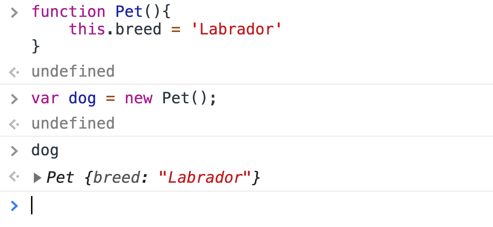
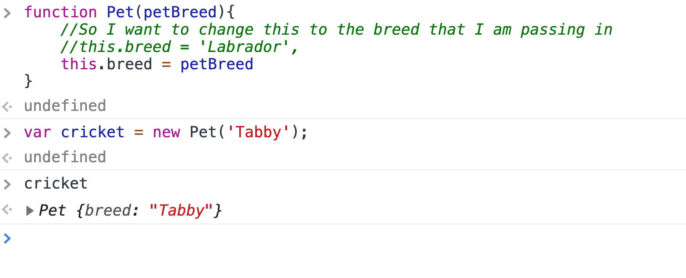
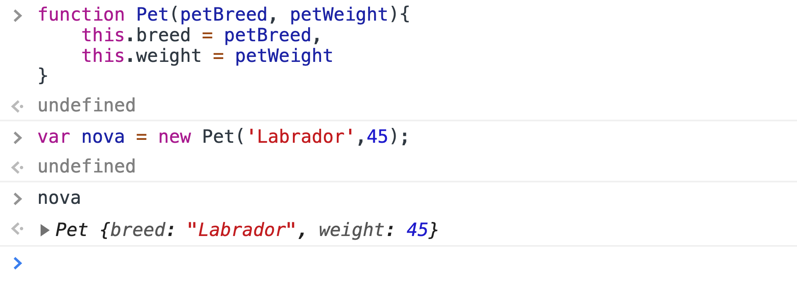

# Programming Concepts Covered


# Announcements


# Code Review 
- This weeks project is meant to take all week with new implementations to our problem domain, we will look at the code possibly refactor some, code and see what we find along the way. 
- What was the one thing that you found hardest, and what you want me to cover in code review. 
- Code review topics 
    1. How to do cookies per hour at each location.
    2. Sales amount in each city( adding things to the page) 
    3. id in html, then put other things into that from js. 
    4. ~ how to do css from js. 

- What do we notice from the student repo. 
    1. latest commits
    2. different branches 
    3. different commits 
    4. We can see that the different commits show that work being added over time. 
    5. Watch out for **CAPITALIZATION.** ( Computers,  go to a terminal on your machine, wsl, cd wr, mac users doesnt matter, run ls, to see macs and windows make a choice where capitols do not matter, the issue is that it is not true on Linux, capitalization matters, so when we deploy our code to for instance git hub, that runs on linux, we want to keep things standardized, with lower case. 90% of sites online are running on linux.)
    6. Make sure different citys get different numbers of cookies. 
- Have student walk you through how to download the clone and start the project. 

- bash  type:  chrome index.html
- bash  type:  chrome sales.html

- ./ css means start from where ever I am at right now. start where the index.html is and then go into the css folder. Not needed, for now, it is good practice, and you will have more practice in 301. The ./ means go a level up from where I am at right now. 

- Go to **Google Fonts**. You can combine font links to one, and then specify in css. 

- What data type is the Seattle variable. === Object
- Using what to store our data            === Key / Value Pair. 
- ctrl F2. to select all instances of a word. 


- City
- Hourly
- Store Totals, is the flow we are looking for. 
- Show the running total with the debugger


- We willl look at how o creat html elements that we will append our UL and LI items to, inorder to create some child/parent relation ship. 

- dont forget to add the city object to the render to loop through each city instead of just hourly array. 

- We do code review so that we get better at reading other's code. 

- Question how was it creating each object literal? How would you feel if you had to type out another 250 stores, by hand from paper. 


- So since these are all the same object literals there are ways, to automate this process, how you ask?

- With code constructors, instead of object literals. 
- Which is what lab 7 will be on.
- currently we have about 15 - 25 lines of code, x 250 objects. 

- So, with a constructor we can create objects, with a max of 15 lines(once) and we can add one line of code to 15 define each city and one to create store, this scales better the more objects we get, Constructors are powerful tools, for developers, so that we write less lines of code and have less of a chance to make mistakes, while coding out our problem domain. 

**Back to our Kitten Demo.**

# Constructors or Constructor functions. 

- it is a function
- it has a specific job to set up objects. (with specific properties(AKA keys))
- Upper Camel Case for the Name. 
- Call with the word "new"  , new is built in key word of javascript. 
- Constructor names tend to be a singular noun. 

- This is how we define functions.  

```js
function Pet(){
}
```
- Other than the capital letter there is no difference with any other function.
- So now inside the constructor, set up the properties we want for objects created with this constructor
- We need key/value pairs on the new object. 
- Within constructor functions we are going to use the contextual this, so we can say that 
### This is a bad constructor, but we will fix it in a minute. 

```js

function Pet(){
    this.breed = 'Labrador',
}
```



- In the console we will write. 
- var nova = new Pet();
- type nova to see the new Pet object, notice that it say's Pet outside the object braces. 
- Try a different dog, 
- console.log is something we write some times. What do we do when we want to give it information? 
- In general if we have a function and we want to provide information to those functions. We pass inbetween parathesis. What do we call those thing in the parathesis. 
- In general we call them parameters, to give the function information so that it can run. 
- So, we will take in the values that we want as parameters to out functions. 



```js
function Pet(petBreed){
    //So I want to change this to the breed that I am passing in 
    /this.breed = 'Labrador',
    this.breed = petBreed
}
```
- Which means now that I need to pass in an argument to the parameter for petBreed.
- So, now in the console I can type 

```js
var cricket = new Pet('Tabby');
```

```js
function Pet(petBreed, petWeight){
    this.breed = petBreed,
    //Name of parmeter and name of property can be the same or different.
    //this.weight = weight,
    this.weight = petWeight,
}
```


- Now go back to the console and pass both parameters in. 
```js
var nova = new Pet('Labrador',45);
```
## BREAK TIME 


- So we have methods in the object literals that we want to make accessible for our other pets methods and behaviors. 


```js
function Pet(petBreed, petWeight, petDescription){
    this.breed = petBreed,
    //Name of parmeter and name of property can be the same or different.
    //this.weight = weight,
    this.weight = petWeight,
    this.desciption = petDescription
}
```

So the methods that exsist within the pets 
- My next step is to take the getDescription function is accessible my every pet, so we have an exact peice of code to set up for this to work, so if there is one thing that you accept about how code just works and does things, we have this, 

```js
//Pet.prototype.functionname = function(any, parameters, go, here)
//Benefit is that with any pet that we create will have access to this function. 
//Technical description takes about three hours of lecture to get through, so we will just trust that this will work, so that all the pet objects we create will have access to these functions, so lets focus on what functions our objects need and then accept the auto magically, the stuff that prototypes do for us. 


Pet.prototype.getDescription = function() {
//The code that goes in here is already using contextual this, so it will work here for us as well. 
//Creat a random index within the pet description array. 
var randomIndex = Math.floor(Math.random() * this.petDescription.length);
//Use that random index, to go into the array and grab a description.
return this.petDescription[randomIndex];

};
```
- So, now lets take the firstPet

```js
    var firstPet = new Pet('Labrador', 45, ['playful','excited','cuddly', 'good girl']);
```

- if we dont know the parameter, we write null, we dont leave it blank because we get syntax errors, so use null, however if we do math on say weight and there is a null you will get back a NaN, response. 

- Now we have just the constructor, so I will comment out the pet object literals. 
- We may also call these objects pet instances. Any time we call the constructor we use the new and the name of the object constructor, and then provide arguments, for the constructor. 

# So how did it go, THUMBS?

- The prototype allows us to create methods accessible by any instance or any object being created by the constructor function, in the console we can call getDescription, now all pets have access to the get description function. Now we can add as many pets as we want and they will all have access to these prototype methods. 

- Add another pet and it works because of us using the contextual this, we can access the description words of that specific pet object. 

- Loops should continue to work as they were and it accesses its information from the array of objects. 

#### What other questions do you have about constuctors? 

- One other part of your lab for today, is HTML tables. 
- So, lab tasks say we should implement a constructor function, instead of the object literal. 
- Change out lists of data to tables of data. Which is how we will build out these tables of data. 
- I advise that you do the constructors first and then build out the tables, do not try and build the entire lab at once, make sure to create our lab 7 branch and commit as soon as you complete a feature. 
- So to start lets look at tables in the HTML 
- A table tag encloses the rows and cells of our table. 
- So, inside the table we want to add a table row, and inside the table row we will hae a cell tag called a <td></td>

- Each table row is defined with the <tr> tag. A table header is defined with the <th> tag. By default, table headings are bold and centered. A table data/cell is defined with the <td> tag.
- Tables are not good when it comes to mobile design. 

```html
<table>
    <thead>
        <tr>
        <th>Hours</th>
        <th>Location</th>
        <th>Contact</th>
        </tr>
    </thead>
    <tbody>
        <tr>
        <td>8am-5pm</td>
        <td>Cedar Rapids</td>
        <td>555-555-5555</td>
        </tr>
    <tbody>
</table>

```

```css
th td {
    border: 1px solid grey;
}
```


- watch out for addition td tags being displayed that will mess up the table order. It allocates space by the content within the cell, tables are not good at being styled and even worse with mobile app. Tables are being styled by the browser as well. 

### Let's create some tables now in our javascript. 

- Writing tables in html is a bit heavy, 
- So lets add a table to store pet data. 
- So typing out our tables can be time consuming and more keystrokes than if we let our javascript, build the table for us.
- So for each of these pets, I want to display a 
- Add table to pet-holder - 
- Then I am going to add a table. 
- With a table row header with breed, weight, and description of that pet is. 

<table id="pet-table">
<tr>
    <td></td>
    <td></td>
</tr>


</table>

- So when we refresh it will have a single row with the titles for our columns. 
- So I am going to add them to the table
- the way that I am going to do that is use creating a render(). on each of my pets. 
```js
 //Add prototype method to add pets to the table.
 ```
- The render() method will allow me to render my pets to the page into a table. 

```js
Pet.prototype.render = function() {


    
}
