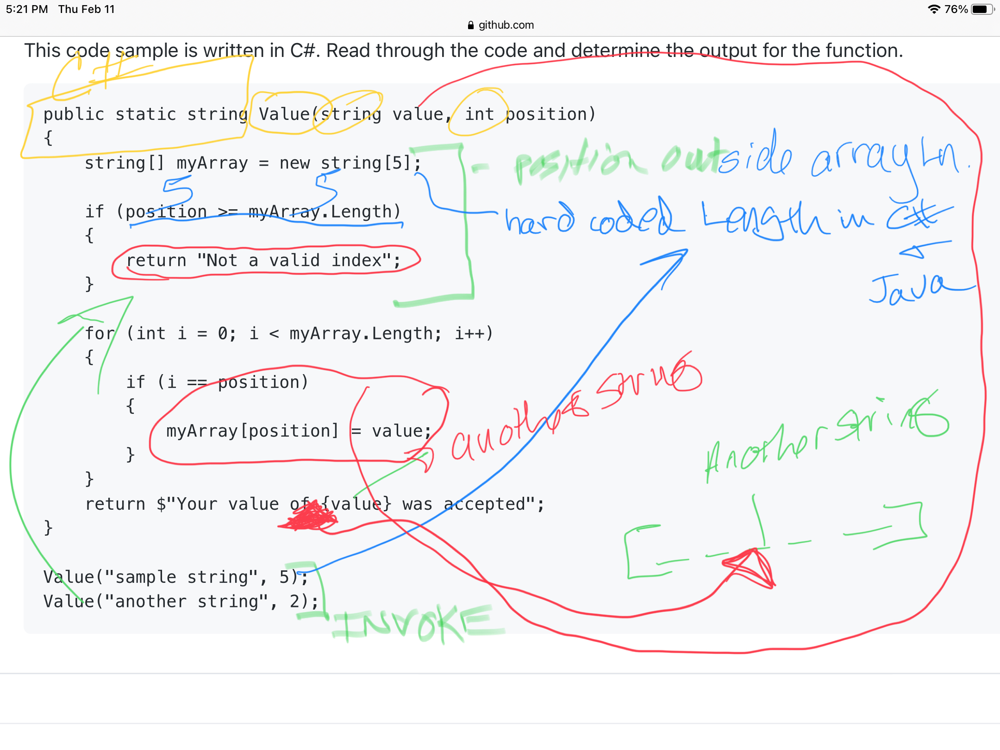

# Good Day Happy Friday
**You Made It to Friday**
--- 

## This has been a big week, thumbs up/down how are you feeling about this week.
- ## First Hour

# Agenda for today
- We will be done by 11:50 today, as I have an appt at 12 to see a Dentist. Not sure when I will be back to lab. 

## Lecture Outline
### Warm-Up
### Code Review
### Shred Talk
### City Explorer Build
### Deployments

--- 
### Warm-Up

### Code Review
### Shred Talk

---
## Ten Minute Break
- ## Second Hour
---
### Take a Look at the whiteBoard images 
### City Explorer Build
- **Why** (5 min)
  - This simple app is a great opportunity to revisit jQuery and dynamic data to cap off the week.
  - We provide them a more complex version of this same app during the next lesson block. This provides the students some context on that application when they see it again.
- **What** (5 min)
- **Experimentation and Discovery Ideas**
  - Get some suggestions from the students as how this app can be better
    - Multiple Cities
    - Movies, Nights Out, Trails, etc
    - What else can they think of?
  - Show the [official/deployed city explorer](https://codefellows.github.io/code-301-guide/curriculum/city-explorer-app/front-end/) to confirm their wishes

---
## Ten Minute Break
- ## Third Hour
---
### Deployments
- **Why** (5 min)
  - Websites don't run from laptops
  - Consumers need to get to actual sites/data
  - Explodes the notion of WRRC by adding a real server
- **What** (10 min)
  - Heroku is one (of many) services that can "host" a server
  - It can connect to GitHub to fetch your source code, install dependencies, and start your service
  - Other hosts (such as godaddy) are setup to host static websites (renting access to a folder)
- **How** (30 min)
  - Using a live-coded demo ...
    - Produce a simple express server with 2 routes (static and dynamic)
    - Deploy to Heroku
  - Sketch out the WRRC to demonstrate what is happening with the server and Heroku.
- **Experimentation and Discovery Ideas**
  - Replace the "hello world" index.html file with the city-explorer-lite app that you previously built.
  - Suggest that students can deploy their portfolios
## Lab Notes

