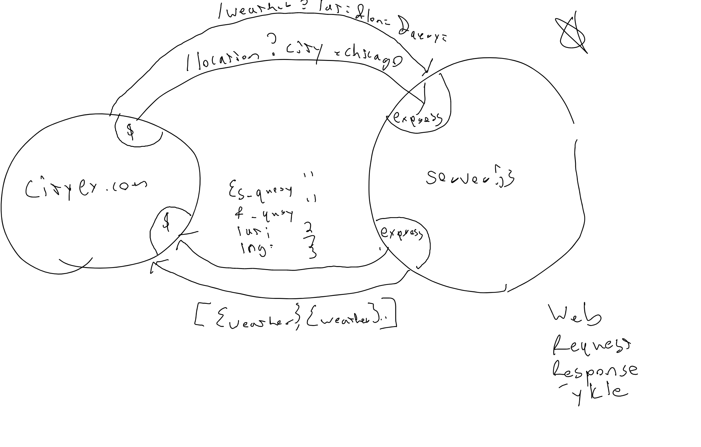

# Good Day Happy Monday WEEK 2

## 3 Main things

1. How do I start a server.
2. How do I create a route.
3. How do I make it give data when someone tries talking to it.

A. by the End of the Day we will have some data rendering to our pages and one
list of weather information. Tomorrow we will look at something called an api
key, so that we can render an image from our calls to the api.

### html

```html

<!-- our default order is 0 like an array.  Start and replacing it with the end and vice versa, end to start by default because of reverse order they  100 115 120 130, order one moves to end means it does not stand for the first, -->

  <div>
    <!--  0  -->
 
  <!--  1  This is lexical order with out the css rule it would have laid out in normal order-->

  <!-- 0  The order is the order they will layout from left to right-->

  <!--  0  At the first flip the 1 will be in this position -->

</div>

```

### styles.css

```css
div {
  display: flex;
  /* Start out with a flex start and then a flex end */
  justify-content: flex-end;
  /* this is saying that we are going to center vertically up and down creating
     spacing on top and bottom of an image or div  */
  align-items: center;
  height: 200px;
  This is reversing the order of our content
  flex-direction: row-reverse;

  /* last try a align-items baseline to show what happens 
  align-items: baseline; 
  
  text and images will try and share the same baseline, same row they written on.
  grid does work with flex , align-items are shared between the two. its the
  content justigy items or content grid vs flex is where some differences are. 
  
  */
  
}


/* we have to pay attention to the order since they are reversed.  */
img:nth-child(2) {
  border: 2px solid red;
  order: 1;
  align-self: baseline;
}

```

## Today we will be learning all about servers

- Lets start by looking at the Lab. In Cavas.

- This is the first day that the labs will be executed through Trello.


- What is a client? - A student to teacher, request things, tempory,
 googler/webpageForm(client as well.)
- What is a server? A temporary. that server responses to requests, google

- Client makes req to server for Food. The relationships are the same. We will
 make req and delegate our responsibilites to another server.
- Server in a restaurant will make a req to the cook for food.
- Afer this week you may begin to see the req/res cycle everywhere, its ok, its
 a code thing.
- for us we will have an actual server.js.

1. Make an entry point to the server file called server.js
2. Then we want to run the npm init command to set up of file scaffolding.
3. Then complete the set questions, to finish setting up apps link to the server
   file. Create the file first!
4. Package.json is now created, and we have key value pairs that annotate the
 server.js file.
5. We will also talk about the concept of the env.

## Draw out the WRRC Here AND OPEN UP SERVER JS FILE TO TYPE OUT COMMENTS

### The WRRC



 **How** (30 min)

- Interactively draw the WRRC for a Single Page App

- **Why** (5 min)
    - An understand of The Web Request Response Cycle is critical to being
      a solid full-stack developer
    - We're about to add 3 more layers to it - servers, databases and remote APIs
    - To this point, we have been largely writing static websites and web pages
      with event handlers
    - Data has been in `.json` files or in raw `{}` objects so far
    - In actual applications, users expect real time data
    - For that, we use APIs, Databases, and Servers to store, collate, and
       ultimately "serve" that data to the client (browser/js)

- ITS WORTH TALKING ABOUT ENV.S AS OUR APPS WILL NO LONGER JUST LIVE ON OUR LOCAL
  MACHINES.

- **What** (10 min)
    - Two Enviromments our apps will live on. Production and Development.
    - Every terminal has an env that we have access to, to run at anytime.
     Server or no Server these are the terminals env  variables needed to
     run the variables.
    - We have played with PATH which is where our executed files are living,
    - Got to terminal and run
      ENV is unique to the window it is running. Same if we open a new tab.
    - Last week we hard coded a PORT, we could do that here and type

  ```js
  export PORT 
  ```

    - This is an us port if we look at it.
    - We could use this port by running our app on 3333. which we will see
      change as we go on this week as it may not be the same port that it
      runs on, on another machine.

## Second Hour

- Lets build our server up, this is good practice for you and at least once a
  day you build up the server, as you become familar with the process you will
  be able to go on and create custom servers.

1. First thing to declare is our packages.
2. Then we need to make sure that we have access to the express framework,

```js
  // the -s stands for save that creates three lines of code for anyone who
  // downloads the repo will have access to express, if we didnt -s they would
  // have to install on their own the library. 

npm install -s express

// This creates the package.json
// we load one time per project we will download as the library will live
// with the project. 

```

```js
// The next library will be cors, which we will need this week only CORS 

On our local machines we have firewalls that will watch to see if our local
machines are trying access remote URLs, we will get blocked, this week we will
run the front end and the back end, when we include CORS we wont get blocked when
making the request. 
```

```js
// The last package we need to load is our env library. 
const env = require('dotenv');
dotenv.config();
// instead of saving it in memory we can call it to load and run. 
// so best practice is this way. 

require('dotenv').config(); runs once and loads env variables if they were loaded
from a file instead of the terminal. 
```

## NOW IN THE TERMINAL run--- npm install -S cors dotenv express

- we can now check our package.json to see the updated list of libraries.

-

## Any Questions about the packages that we are going to load

## Now we can set up the application server

1. const app = ('express');
2. New line from Friday. app.use(cors()); So that local request dont get blocked.
   Loads before our routes get hit.
3. Load our Global Variables as we need them.
4. Now lets Start the Server. We need to add the app.listen which takes in a callback
5. Make a Global Variable for our PORT

- This is the basic set up of our server.
- Then we will add routes.

## Now lets Start the Server. We need to add the app.listen which takes in a callback

```js
app.listen(3000, () => console.log(`we are listening on PORT: ${3000}`));
//- This is a server being built and now we only need to add the routes. 
//- we will deal with the hard coded port in a minute, but this is the end goal
// in building servers. 
//- got to local host 3000 and see the error coming from the express app. 
//- Now lets make it better. 
```

## Make a Global Variable for our PORT

```js
const PORT = 3000; 
//Capitolization are sometimes refered to as Magic Variables. other things rely
// on this variable. 
//- lets add the env file now. 
const PORT = process.env.PORT;

//- Show in browser the 3333 port not working when we go to 3000 and of course
// in the new terminal which has port 3000 will not find 333


//- this file is going to be called the .env, which is a secondary location for
// referencing our variables, but our packages can read them 
//-The specific syntax is the caps, no spaces, no semi colons. It is a file that
// is accessible from both terminal windows, so that we have a back up, 
//We need to treat this as a secure file that will not go out onto git hub. 


// Now another and third back up with the OR and select 
const PORT = process.env.PORT || 3111;
// - if we see our last result show up in the terminal we should look at our app
// and fix what is broken with our initial routes. 

```

## Lets build a home Route

- Routes

1. app.get home route
2. its just the code that fires off when someone wants to access this route.

## But first lets fix our Server up alittle

- Instead of starting our server with node.
- We are going to use nodemon
- Nodemon or nodemon, a demon is a process that runs in the back of your computer
- It is a server that runs servers on it, it is like a live-server
  for your server files.
- We can say nodemon and it will run our server.
- We can see the changes in the terminal.
- and restarts the server but does not restart the browser, so we have to do that.

- The command is

## npm i -g nodemon

- g is global and we can use it on all projects.

### Now lets do a route that can take dynamic data in

```js
  //Object iteration 

const cohort ={
bob : {name: 'Bob', backGroundColor: 'red'},
larry : {name: 'Larry', backGroundColor:'blue'},
gerry : {name: 'Gerry', backGroundColor: 'green'},
garry : {name: 'Garry', backGroundColor: 'yellow'}
};
// for(let i in arr) iterate i throug every key of the object
 
// for(let i in cohort){
//   console.log(i);
//   console.log(cohort[i]);
// }


//Today we will use two methods. 

//1. Object.keys(object);

// console.log(Object.keys(cohort));


//we could then 
const keyArr = Object.keys(cohort);

keyArr.forEach(studentKey => console.log('hello ' + studentKey));


// keyArr.forEach(studentKey => console.log(cohort[studentKey]));

keyArr.forEach(studentKey => {
// console.log(cohort[studentKey])
});


console.log(Object.values(cohort));
//is an array of values 


Object.values(cohort).forEach(student => {
  console.log(student.backGroundColor);
});


//Object.values(object); puts the values into another array. takes each entry
// in an object, then entry is the key and the value and puts it in an array
// of arrays. 
console.log(Object.entries(cohort));

Object.entries(cohort).forEach(minArr => {
  if(/^[a-g]/.test(minArr[0])){
    console.log(minArr[1].backGroundColor);
  }
});

//in lab you will be asked to use these methods to get the job done today. 

```

- Deploy to Heroku, so review the PROCESS of that deployment with them.
- Don't dig in to the server code, since that will be a topic today anyway.
- Conclude Code Review time with an preview of what work will be done on the
  server side this week.


## Third Hour

---
