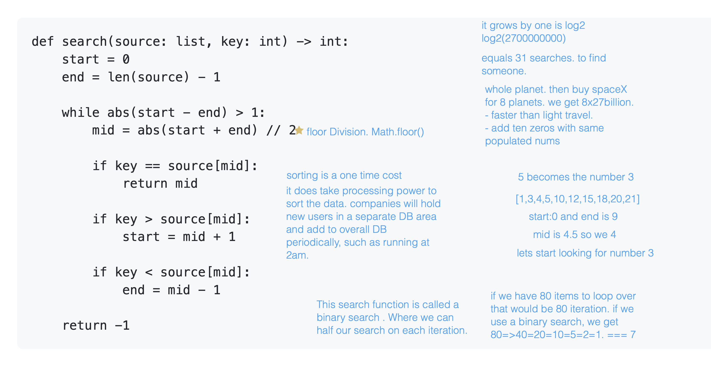

# Happy Day
**You Made It**
--- 
- ## First Hour

## Lecture Outline

### Warm-Up
- Binary Search
- log2(6470000000000000) universes. 
- so we are starting at the mid point and checking for values. 
- which implies we have a sorted list. 
- [1,2,3,4,5,6,7,8,9,10,11]

### Shred Talk

### Code Review

- **What** (10 min)
  - HTML, CSS, JS
  - jQuery/Mustache
  - Express
  - Build a **simple** dynamic web app with a template
  - Build a **simple** express server with 1 route serving JSON
  - Connect them with `$.ajax()`
  - Students should know 100% of this
  - Stress that this is boilerplate!

### Pagination

- **Why** (5 min)
  - Most APIs don't provide all the data they have
  - Rather, you'll get to all of it in chunks of, for example 10 records at a time
  - How can the user get to the data they don't see on the initial rendering, when they are ready for it?
- **What** (10 min)
  - A "get more" button is a great place to start
  - We already went to the server with `$.ajax()` to get the data to render
  - We can go back again for more to augment our display
    - We are allowing WRRC "on demand". User action triggers another request-response. 
    - This can be as simple as "get more" and append to the list, making it infinitely scrolling
    - Alternatively, add links for "Next" and "Previous" to let the user fetch a different page of results and toggle between them
  - What's the difference?
    - The calls to the server are the same.
    - It comes down to the rendering. Are you replacing what's in the target element with the data you fetch (`.html()`) or are you adding to it (`.append()`)
- **How** (30 min)
  - Demo: Pagination

---
## Ten Minute Break
- ## Second Hour
---

---
## Ten Minute Break
- ## Third Hour
---
### Refactoring

- **Why** (5 min)
  - Code isn't always poetry
  - You want to integrate new technologies/libraries
  - You get better and learn new things
  - You want to integrate more advanced design patterns
- **What** (10 min)
  - Break large functions into smaller chunks
  - Identify areas for reusable functions
  - Identify common patterns
  - Seek opportunities to extend or abstract functionality
- **How** (30 min)
  - Demo: Refactor simple code
  - Demo: Refactor city explorer code
- **Experimentation and Discovery Ideas**
  - Have the students drive the discovery (with gentle leadership)